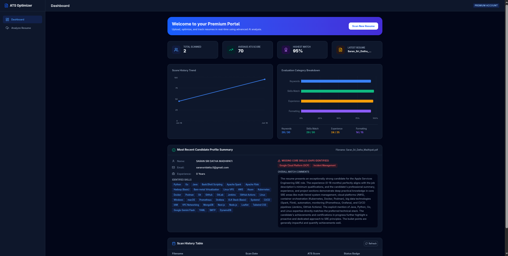
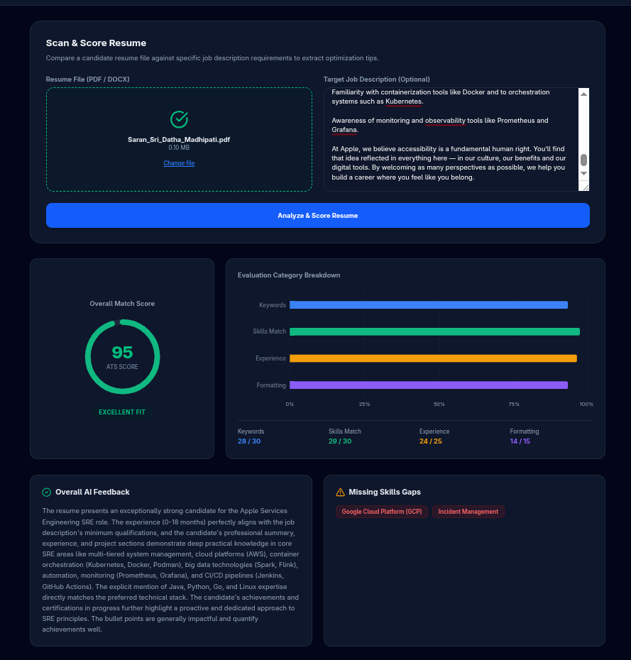
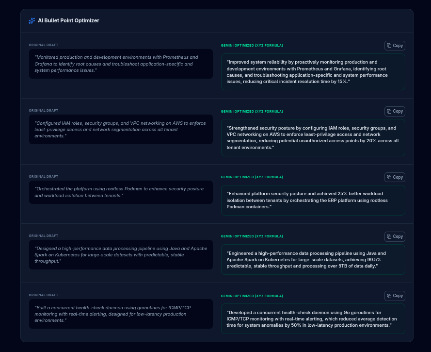

# AI Resume Analyzer & ATS Scoring Platform



A modern, full-stack AI-powered platform designed to analyze resumes, score them against Applicant Tracking Systems (ATS) criteria, and provide actionable optimization feedback utilizing the Google Gemini API.

## Features

- **Smart ATS Scoring:** Evaluates your resume based on keyword density, skills match, experience, and formatting.
- **Job Description Alignment:** Compares your resume against a target job description and highlights critical missing skills.
- **AI Bullet Point Optimizer:** Automatically rewrites generic bullet points into high-impact, quantitative achievements.
- **Premium Dashboard Interface:** Built with React, Tailwind CSS, and Framer Motion for a sleek, responsive, and animated user experience.
- **History Tracking:** Automatically saves and tracks your past resume scans and their scores.
- **File Support:** Seamlessly parses text from PDF and DOCX formats.

## Screenshots

| Scan & Score Dashboard | AI Bullet Optimizer |
|---|---|
|  |  |

## Technology Stack

- **Frontend:** React, Vite, Tailwind CSS, Framer Motion, Recharts, Lucide React
- **Backend:** Node.js, Express, Multer (File Uploads), pdf-parse, mammoth (DOCX parsing)
- **AI Engine:** Google Gemini API (`@google/genai`)
- **Database:** Local JSON File Storage (Mock/Testing) / Mongoose (Ready)

## Quick Start

### Prerequisites
- Node.js (v18+ recommended)
- A [Google Gemini API Key](https://aistudio.google.com/app/apikey)

### 1. Clone & Setup
```bash
git clone <your-repository-url>
cd resume_analyzer
```

### 2. Environment Variables
Create a `.env` file inside the `backend/` directory and configure your keys (you can copy from `.env.example`):
```env
PORT=5000
GEMINI_API_KEY=your_gemini_api_key_here
MOCK_GEMINI=false
DB_PATH=./db.json
TEST_LOCK_DB=false
```

### 3. Run the Platform
We provide a convenient bash script to start both the Frontend and Backend concurrently:

```bash
chmod +x run.sh
./run.sh
```

- **Frontend:** [http://localhost:5173](http://localhost:5173)
- **Backend API:** [http://localhost:5000](http://localhost:5000)

## Testing
The platform comes with a comprehensive End-to-End (E2E) testing suite comprising 60 automated tests covering feature paths, boundary cases, and real-world workloads.

To execute the test suite:
```bash
cd backend
npm run test
# OR
node tests/run-e2e.js
```

## Project Structure

```
.
├── backend/                  # Express API server & Gemini integration
│   ├── src/
│   │   ├── controllers/      # API Route Controllers
│   │   ├── services/         # Gemini & Text Parsing Services
│   │   └── models/           # Data Storage
│   └── tests/                # E2E Test Suite
├── frontend/                 # React UI Application
│   ├── src/
│   │   ├── components/       # Reusable UI Components
│   │   ├── context/          # Theme & Global State Context
│   │   └── services/         # API Integration layer
├── media/                    # Documentation screenshots
├── run.sh                    # Dual-server startup script
└── README.md
```

## License
This project is licensed under the MIT License.
